

# CYBER DATA NEXUS

### Intelligent Data Management System with Cloud Distributed Storage and Automatic AI-Based File Classification and Tagging

#### Bachelor's Degree Qualification Thesis

**Specialty:** 122 "Computer Science" · Intelligent Software Systems and Technologies
**University:** V. N. Karazin Kharkiv National University
**Author:** Vladyslav Petryk · Kharkiv, Ukraine · 2026

---
## 📌 About the Project

**CYBER DATA NEXUS** is a web application for centralized file management that combines **cloud object storage** with **intelligent automatic classification and tagging** of documents based on NLP models.

### Key Idea

> Instead of users manually organizing files, the system **automatically analyzes the file name and extension content**, determines its thematic belonging, and builds a logical storage structure — combining the reliability of cloud infrastructure with the intelligence of NLP models.

---
## 🧠 Theoretical Foundation

The solution is based on three directions explored and compared in the theoretical part of the work:

| Direction | What Was Researched |
|---|---|
| **Cloud & Distributed Storage** | File/block/object storage, replication, sharding, principles of CAP-like distributed systems (scalability, fault tolerance, transparency, load balancing, consistency) |
| **Intelligent Classification & Tagging** | Comparison of statistical methods (TF-IDF, BoW), classical ML and transformer models; justification for choosing a pre-trained encoder instead of fine-tuning "from scratch" |
| **Analysis of Existing Solutions** | Review of Google Drive, Dropbox, OneDrive — identified lack of built-in automatic classification mechanisms, which became the justification for developing a custom solution |

---
## ⚙️ Technology Stack

<table>
<tr>
<td valign="top">

**Backend**
- Python
- Flask (REST API)
- SQLAlchemy (ORM) + psycopg2
- Flask-Login + PyJWT (auth)
- bcrypt (password hashing)
- boto3 (S3-compatible client)

</td>
<td valign="top">

**Frontend**
- HTML5 / CSS3
- Vanilla JavaScript (no frameworks)
- Fetch API
- Canvas API (analytics charts)

</td>
<td valign="top">

**Data & Infrastructure**
- PostgreSQL (Supabase)
- Backblaze B2 (S3-compatible storage)
- Presigned URL (direct upload)
- Cloudflare CDN

</td>
<td valign="top">

**AI / ML**
- `sentence-transformers/all-MiniLM-L6-v2`
- scikit-learn (LogisticRegression, OneVsRestClassifier)
- GridSearchCV
- Synthetic dataset (100,000 samples)

</td>
</tr>
</table>

**Testing Tools:** Postman (functional / API testing), Apache JMeter (load testing)

---
## 📑 Table of Contents
- [Functional Features](#-functional-features)
- [System Design (UML)](#-system-design-uml)
  - [Requirements Analysis](#requirements-analysis)
  - [Use Case Diagram](#use-case-diagram)
  - [Sequence Diagram](#sequence-diagram)
  - [Architecture & Component Diagram](#architecture--component-diagram)
  - [Data Structure Design (ER)](#data-structure-design-er)
- [Implementation](#-implementation)
  - [User Interface](#user-interface)
  - [Server Side & REST API](#server-side--rest-api)
  - [Cloud Storage](#cloud-storage-backblaze-b2)
  - [Automatic Classification Module](#-automatic-classification--tagging-module)
- [Testing & Results](#-testing--results)
- [Future Development](#-future-development)
- [Author](#-author)

---

## ✅ Functional Features

**Core System Functions:**
- 📤 Upload arbitrary file formats with automatic metadata registration
- 🤖 Automatic semantic content analysis and tag generation
- 🗂️ Automatic hierarchical category/subcategory structure formation
- 🔍 Semantic search and filtering by name, tags, category
- ✏️ Manual tag and category editing with stabilization of manual edits
- 📊 Analytics dashboard (10 metrics, 8 interactive charts on Canvas API)
- 🔔 Smart Alerts — automatic duplicate detection, missing tags, classification errors
- 🔗 Public file links (tokenized access)
- 🗑️ Soft file deletion with history preservation for audit
- 📜 Complete audit log of all user actions

An **RBAC** role-based access model is implemented with three hierarchical roles: **Viewer → Editor → Admin** (each subsequent role inherits the capabilities of the previous one).

| Role | Capabilities |
|---|---|
| **Viewer** | registration/authentication, profile viewing, file viewing, document preview, notification management |
| **Editor** | + file upload and deletion, manual tag/category editing, bulk operations, analytics dashboard viewing |
| **Admin** | + user and role management, audit log viewing |

---

## 🏗️ System Design (UML)

### Requirements Analysis

**12 functional requirements** (FR1–FR12: registration, authentication, upload, auto-classification, auto-tagging, directory structure building, search, manual tag editing, etc.) and **11 non-functional requirements** (NFR1–NFR11: response time ≤ 2 s, file processing ≤ 10 s, ≥ 50 concurrent users, 99% availability, bcrypt password hashing, portability to Ubuntu 20.04+, etc.) were defined.

### Use Case Diagram

The model includes three user roles (Viewer/Editor/Admin) and three external actors: **AI System** (classification module), **Cloud Storage** (Backblaze B2), **PostgreSQL DB** (Supabase).

  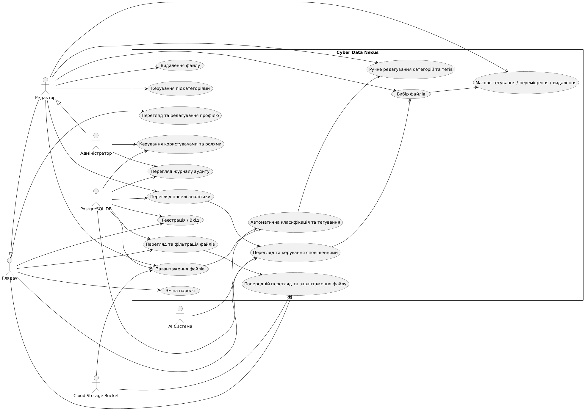

### Sequence Diagram

**Authentication & File Upload** — bcrypt password verification → JWT issuance → file passes through AI classifier → storage in Backblaze B2 → metadata recording in PostgreSQL.

  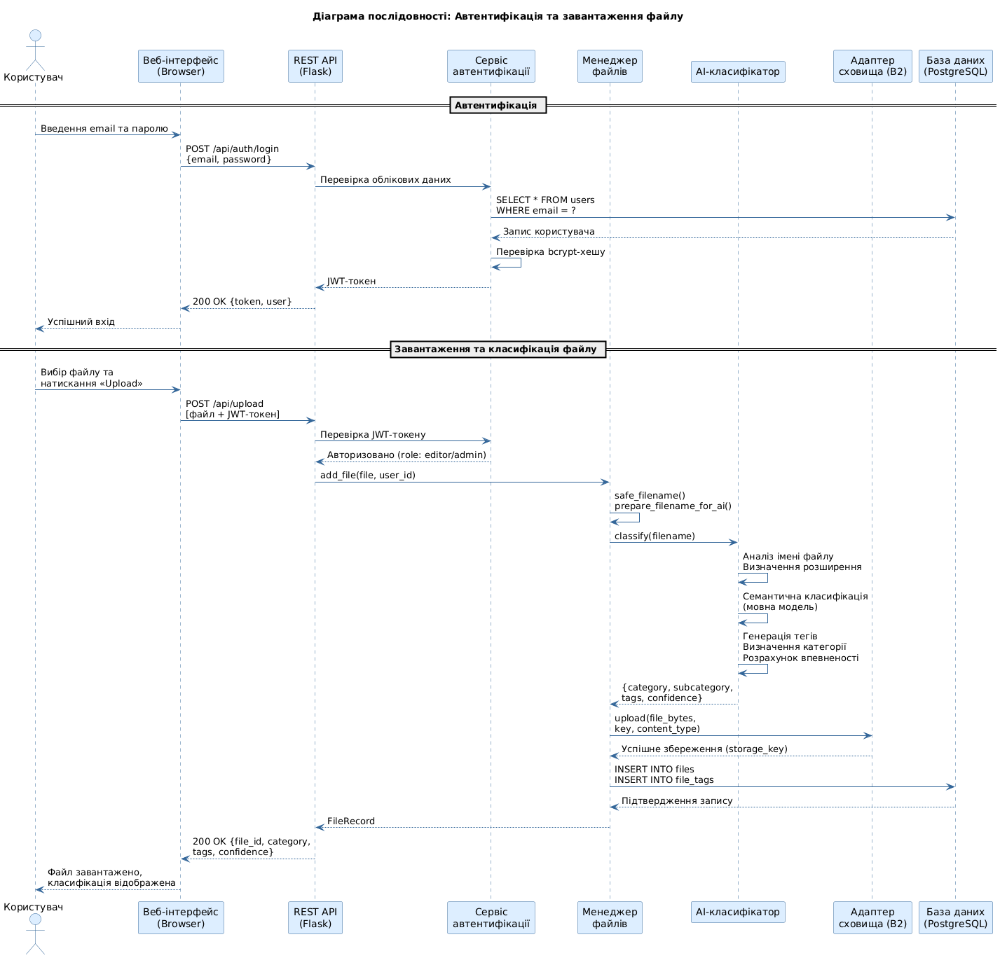

### Architecture & Component Diagram

The system is built following **Layered architecture** principles with six layers: UI → request processing application layer → business logic → intelligent processing → data management → cloud environment integration.

  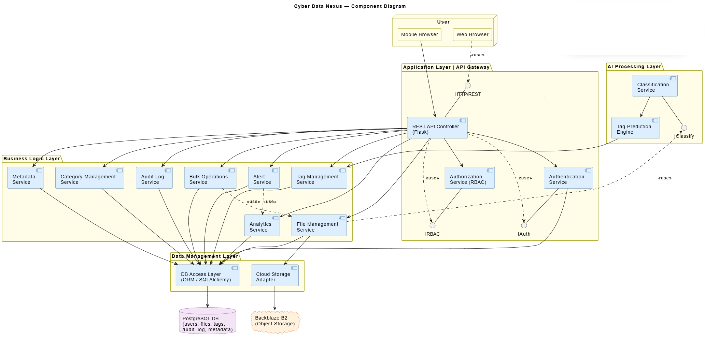

### Data Structure Design (ER)

The database is normalized to **Third Normal Form (3NF)**. Main entities: `User`, `File`, `File Tag`, `Storage Object`, `Public Link`, `File Ownership`, `Audit Log`, `Role Request`.

  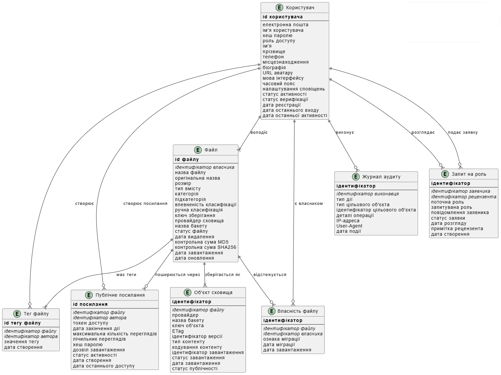

---

## 💻 Implementation

### User Interface

Multi-page SPA-like interface built with HTML5/CSS3/Vanilla JS in a dark color scheme with accent blue.

**Landing Page**

  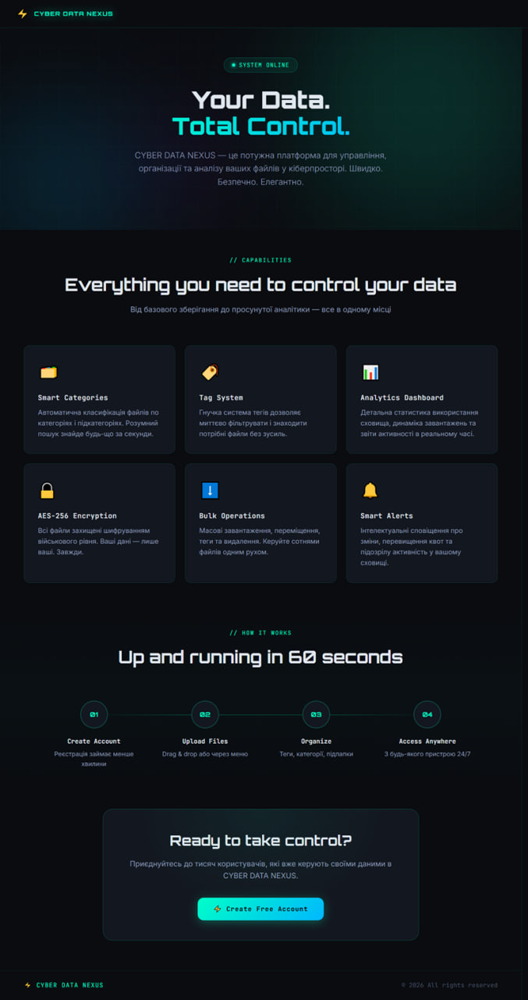

**Main Dashboard** — view and available functionality depend on role (RBAC)

Main dashboard for a user with Viewer role:

  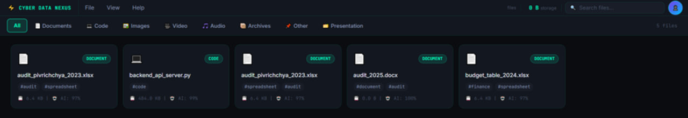

Main dashboard for a user with Admin role:

  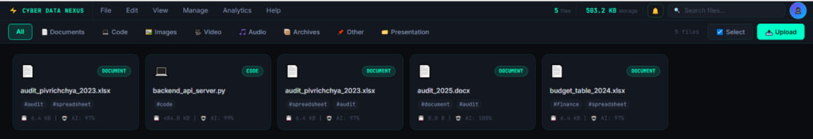

**User Profile** with role chip and ability to submit role upgrade requests

User profile for a user with Viewer role:

  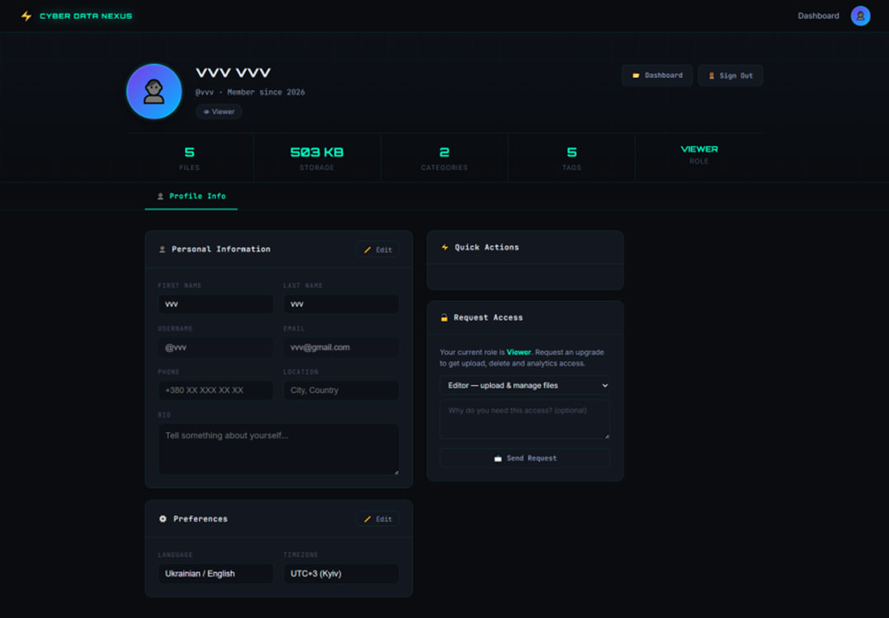

User profile for a user with Admin role:

  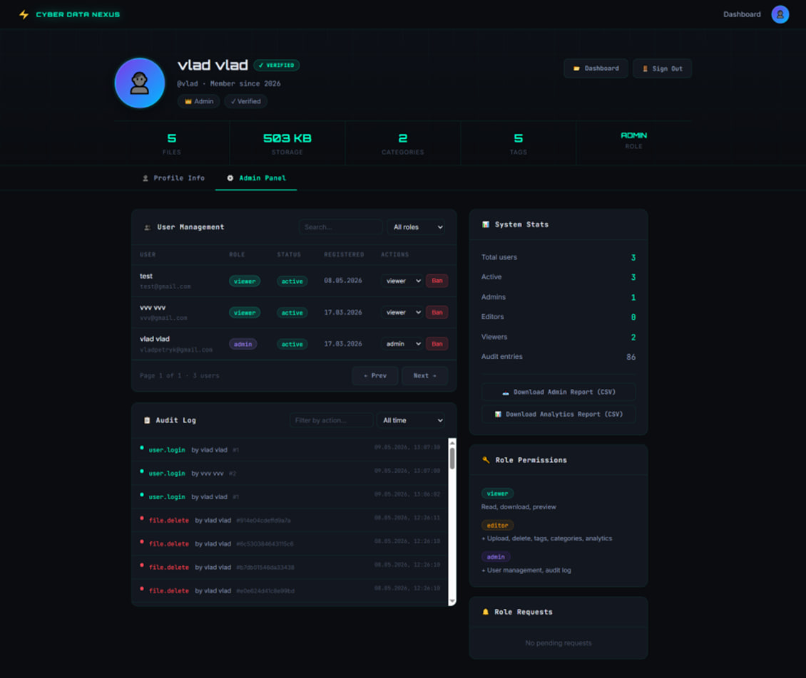

**Notification Panel** — color-coded criticality (red/yellow/blue)

  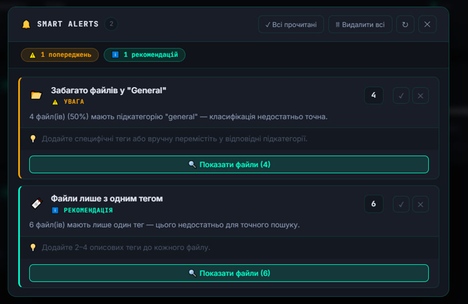

**Analytics Dashboard** — 10 metrics, 8 charts (Canvas API): category pie chart, top tags, top files by size, activity heatmap

  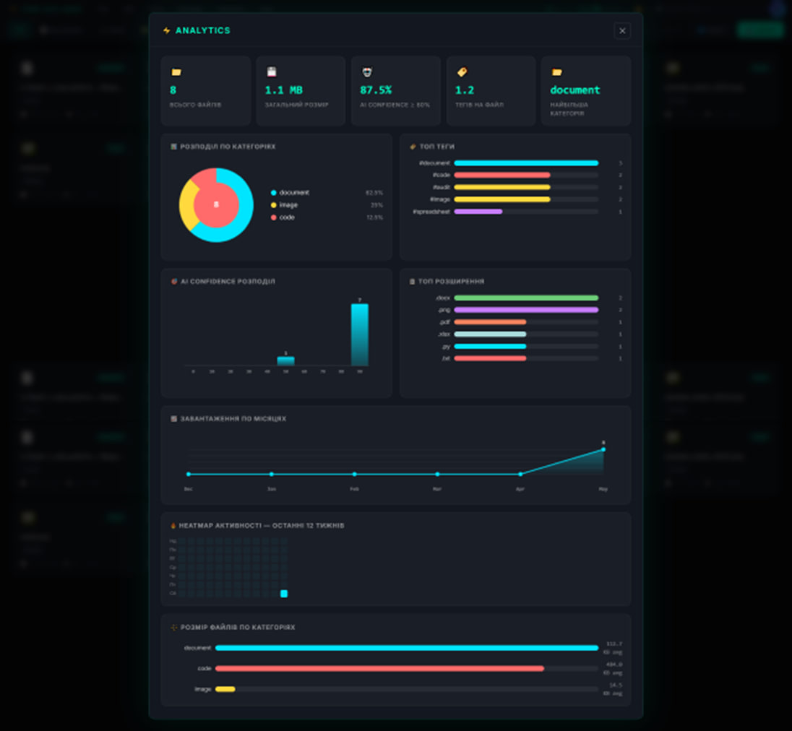

### Server Side & REST API

The server is built modularly: `app.py` (routes and initialization), `auth` package (authentication/authorization), `ai` package (classification), `cloud` package (B2 integration), `config.yaml` (centralized category configuration, tag synonyms, transliteration tables).

**Over 30 REST API endpoints** are implemented, grouped by functionality:

<b>Expand full endpoint list</b>

| Method | Endpoint | Description |
|---|---|---|
| POST | `/api/register` | User registration |
| POST | `/api/login` | User authorization |
| POST | `/api/logout` | Logout |
| GET / PUT | `/api/profile` | Get / update profile |
| GET | `/api/files` | File list |
| GET | `/api/files/{id}` | File information |
| POST | `/api/files/upload` | Initiate file upload |
| DELETE / PUT | `/api/files/{id}` | Delete / update file |
| GET | `/api/files/{id}/download` | Download file |
| GET | `/api/files/{id}/preview` | Preview |
| GET | `/api/search` | File search |
| POST / PUT / DELETE | `/api/files/{id}/tags` | Tag management |
| PATCH | `/api/files/{id}/category` | Change file category |
| GET / POST / DELETE | `/api/categories` | Category management |
| POST | `/api/share` | Public link |
| POST | `/api/bulk`, `/api/bulk/tag`, `/api/bulk/move`, `/api/bulk/delete` | Bulk operations |
| GET | `/api/stats`, `/api/analytics` | Statistics & analytics |
| GET | `/api/admin/users`, `/api/admin/audit` | Administration & audit log |
| PUT | `/api/admin/roles` | Role management |

All routes are protected by `@login_required` and `@permission_required` decorators (JWT authorization + RBAC). Search is implemented via in-memory cache with result ranking (exact name match — 100 points, partial — 40, tag match — 30).

  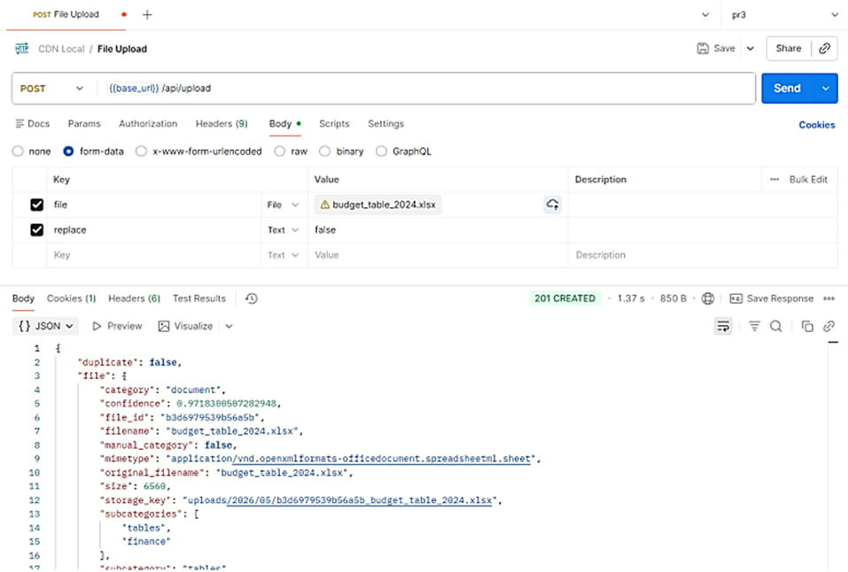

**Database:** managed PostgreSQL platform **Supabase**, accessed via SQLAlchemy ORM. Eight models, composite indexes (`ix_files_category_status`, `ix_files_user_status`), UUID as file primary key.

  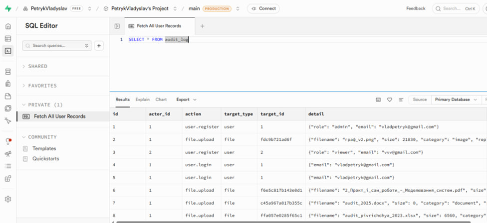

### Cloud Storage (Backblaze B2)

Four providers were compared (AWS S3, Google Cloud Storage, Azure Blob, Backblaze B2) by storage cost, egress traffic, S3-compatibility. **Backblaze B2** was selected: lowest cost (≈0.005–0.0069 USD/GB/month vs ≈0.023 USD in AWS S3), full S3-compatibility via `boto3`, Presigned URL support.

Key architectural feature — **direct file upload from client to cloud via Presigned URL**, which completely offloads the application logic server. Links are valid for 1 hour and signed with AWS Signature v4 algorithm.

The `R2Storage` class encapsulates operations: `build_key`, `upload`, `download`, `delete`, `exists`, `get_presigned_url`, `copy`.

  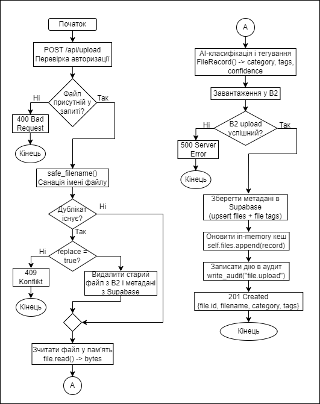

### 🤖 Automatic Classification & Tagging Module

The most important intelligent component of the system — the semantic file classifier.

**Model:** `sentence-transformers/all-MiniLM-L6-v2` — 6-layer transformer, 384-dimensional embedding space, 22.7 million parameters, pre-trained using SimCSE methodology.

**Pipeline:**
1. Transliteration of Cyrillic and Unicode normalization
2. Encoding file name into semantic vector (frozen encoder, feature extraction, no fine-tuning)
3. Category classification — `LogisticRegression` (single-label)
4. Tag classification — `OneVsRestClassifier` (multi-label, probability threshold p ≥ 0.4)
5. **Three-level priority system**: file extension → tag mapping table → AI model result

**Synthetic Dataset:** 100,000 samples (JSONL), 90% train / 10% val, generation based on stochastic token combinatorics from thematic pools (EN/UK), with intentional noise (10% tag removal, 5% irrelevant tag addition) to improve model robustness.

  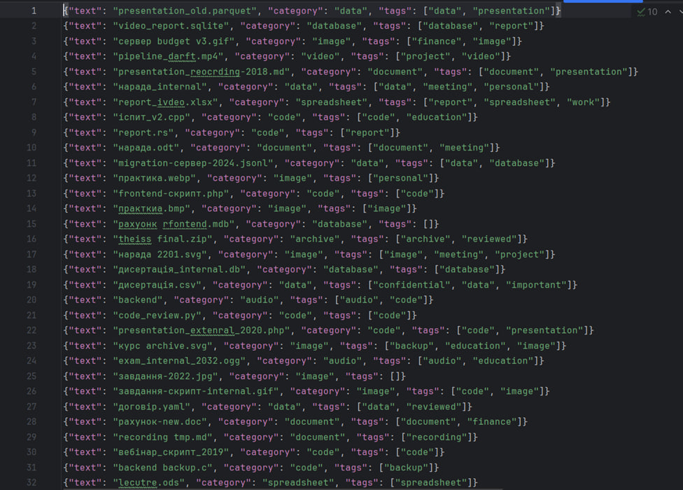

**Hyperparameters** tuned via `GridSearchCV` (3-fold CV): category classifier — C = 1.0 (lbfgs); tag classifier — C = 3.0.

**Quality Metrics on Validation Set:**

| Classifier | Metric | Value |
|---|---|---|
| Categories | Accuracy | **91.39%** |
| Categories | Macro F1 | **0.921** |
| Tags | Micro F1 | **0.781** |
| Tags | Macro F1 | **0.651** |
| Tags | Hamming Loss | **0.032** |

  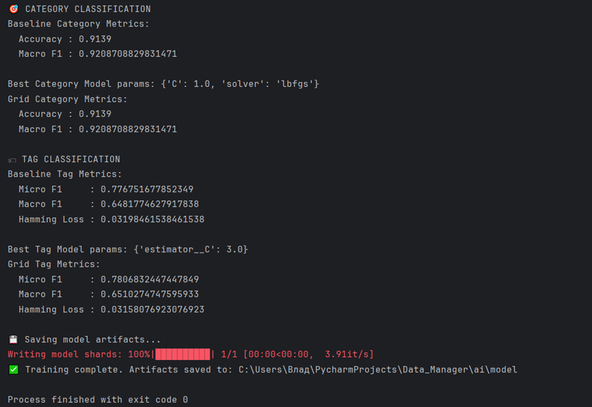

Result: 4 self-contained inference artifacts (`encoder/`, `category_model.pkl`, `tag_model.pkl`, `tag_binarizer.pkl`), loaded once at Flask application startup.

---

## 🧪 Testing & Results

Testing covered authentication, file management, cloud integration, REST API, AI classification accuracy, RBAC, performance, and security. **Postman** (functional/API testing) and **Apache JMeter** (load testing) were used.

### Functional Testing

A set of test cases was created (authentication, role change, file transfer between categories, access permission verification) — all executed successfully, RBAC correctly prohibits operations beyond user permissions.

  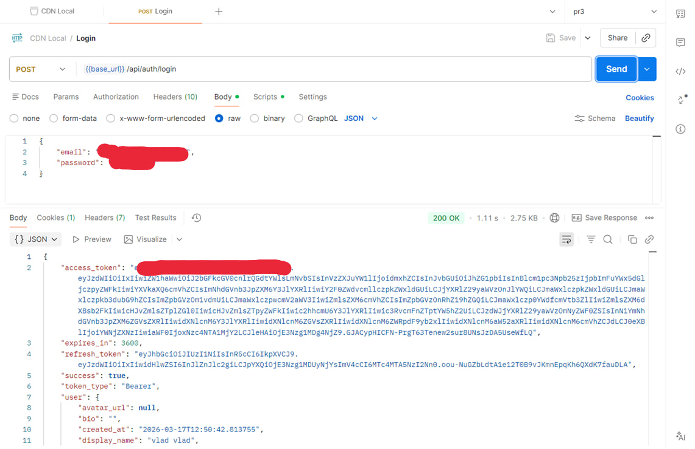

### Automatic Classification Accuracy

| Test File Group | Average Confidence |
|---|---|
| Standard English names | **97.3%** |
| Cyrillic names (with transliteration) | **95.3%** |
| Ambiguous names | stable operation of extension priority |

**Overall Summary Metrics:**
- Full correctness (category + subcategory + tags): **85%**
- Main category identification correctness: **95%**
- Average model confidence across entire test set: **91.2%**

Edge case errors were identified and analyzed: files without extension (lowest confidence — 23%) and formats without explicit rules in configuration (e.g., `.pptx`).

### Load Testing (Apache JMeter)

Read scenario: 50 parallel threads × 20 iterations = **2050 requests** in 46 seconds.

| Metric | Value |
|---|---|
| Error Rate | **0.00%** |
| Throughput | **45.0 requests/s** |
| Average GET Response Time | **870 ms** (NFR1 requirement: ≤ 2000 ms ✅) |
| Authentication Time | 911 ms (intentional bcrypt slowdown) |

Write scenario (file upload): deduplication mechanism worked correctly — first request `201 Created`, duplicates `409 Conflict`.

Load test results for read scenarios:

  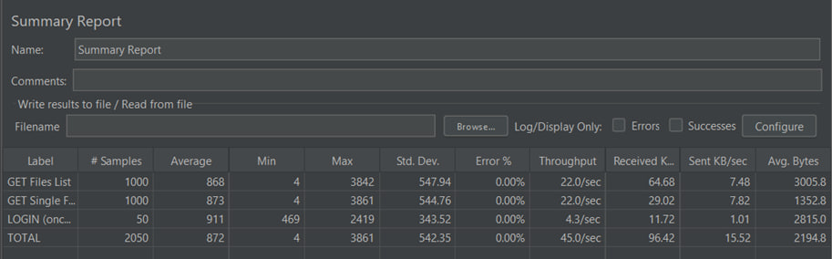

Load test results for write scenario:

  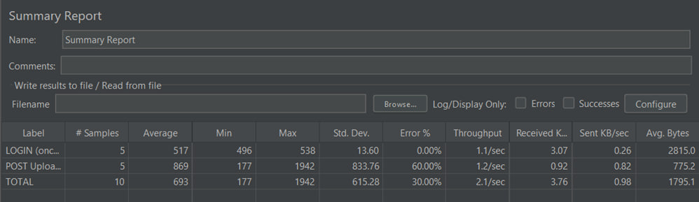

### Security Testing

Request without authorization token to a protected endpoint was correctly rejected (302, 27 ms). Protection implemented at three levels: bcrypt password hashing, JWT (HS256, TTL 60 min), HTTPS/TLS for all connections, RBAC decorators on every endpoint.

  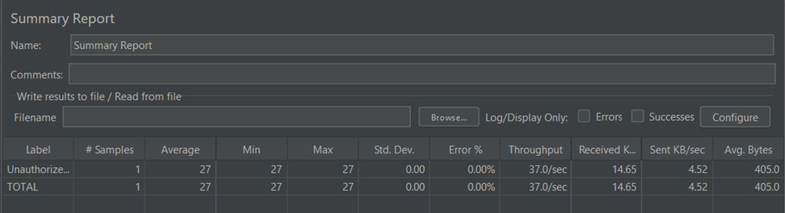

---

## 🚀 Future Development

- Replacing the rule-based semantic model with a full-fledged transformer-architecture neural network (potential accuracy increase to 98–99%)
- Full-text analysis of document content (not just file names)
- Mobile application with offline mode and background synchronization
- Integration with external services (Google Drive, Notion, Slack) as a unified data management hub

---

## 👤 Author

**Vladyslav Petryk**
[GitHub](https://github.com/PetrykVladyslav)

Bachelor's Qualification Thesis · V. N. Karazin Kharkiv National University · 2026

